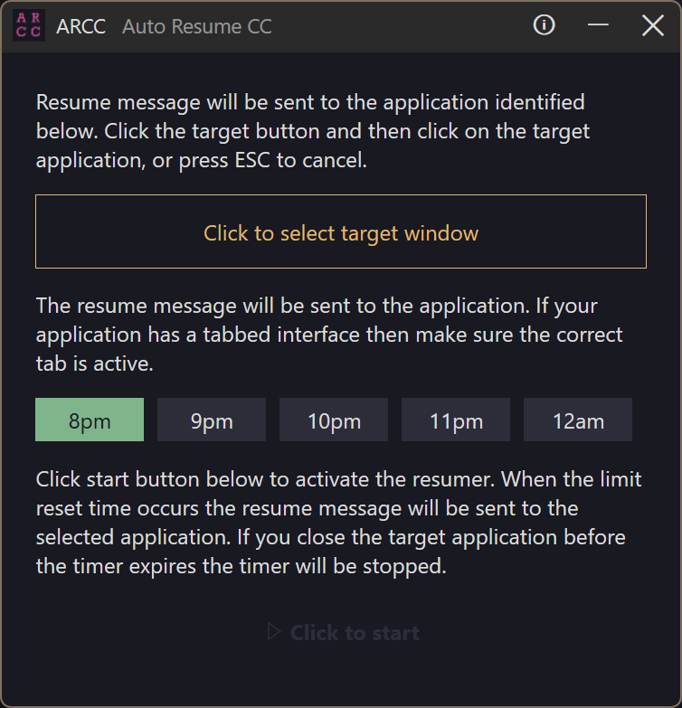

# ARCC - Auto Resume CC

Automatically types "RESUME" followed by Enter into a terminal (or other application window) at a scheduled time. Useful if your llm session is mid-flight processing a prompt and you reach your usage limit and you don't want to wait around to type "resume" in the console. I found this particularly useful when a limit is reached but the reset time is early in the morning.

## Notes & Disclaimer

⚠️ **Important**: This application sends keyboard input to the selected application. It's designed for legitimate use. Ensure you comply with the terms of service of your tool provider.

⚠️ **Alpha Release**: This is an alpha release. Please use with care and provide feedback.

⚠️ **Sleep and Display**: When the countdown timer is running the application will request that your PC not sleep nor turn off the display. Bear this in mind when using this tool. 

## Usage

1. Open the application. Follow the instructions on the screen.



## Requirements

Windows 11 (tested)
Windows 10 (not tested)

## Building

### Prerequisites

- Windows 10/11
- Visual Studio 2022 with C++ Desktop Development workload
- Or MSBuild tools

### Build with Visual Studio 2022

1. Open `src/ARCC.sln` in Visual Studio 2022
2. Select Release configuration and x64 platform
3. Build → Build Solution (Ctrl+Shift+B)
4. The executable will be in `src/x64/Release/ARCC.exe`

### Build with MSBuild

```cmd
msbuild src/ARCC.sln /p:Configuration=Release /p:Platform=x64
```

## Feedback

You can find me on [X](https://x.com/fjzeit).

## Issues and pending improvements

* When timer is running and user selected "change target" but then hits ESC the target is cancelled but the timer still runs. The timer should stop.

* Should allow user to navigate to their target application via the taskbar.